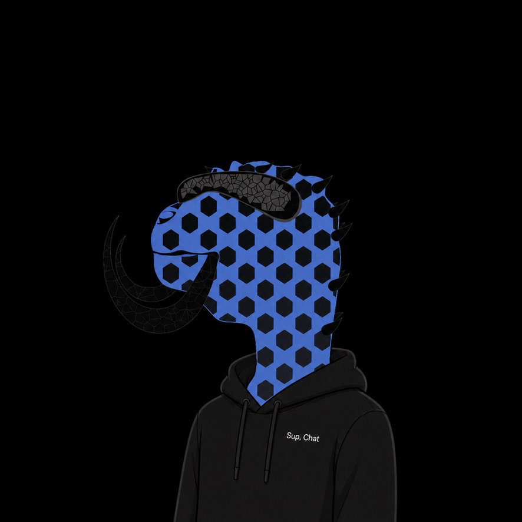

# Phils

Create your Phil, keep the artwork and name you like, and mint it on Ethereum Mainnet.

## Download for Mac

### [Download Phil — Build 93](https://github.com/lengyeltyler/genesis-phil/releases/download/v0.3.0-build93/Phil-0.3.0-93-macOS-arm64.dmg)

**Version 0.3.0 · Build 93 · Final release for this collection**

[Installation and minting guide](docs/GETTING-STARTED.md) · [Release details](https://github.com/lengyeltyler/genesis-phil/releases/tag/v0.3.0-build93) · [Troubleshooting](docs/TROUBLESHOOTING.md)

Open the download, drag **Phil** into **Applications**, then open Phil from Applications. No Terminal, developer account, API key or hardware wallet is required for normal app use. Download the DMG, not GitHub’s automatically generated source-code archives.

**Requirements:** an Apple Silicon Mac (M-series), macOS 12 or later, a Mac login password, an internet connection, and ETH on Ethereum Mainnet for network fees. macOS 12 is the build target; physical testing has been performed on macOS 27, not every earlier version. Intel Mac, Windows, Linux, mobile and browser minting versions are not available.

The app and installer are Developer ID signed and Apple notarized. Publisher: **Tyler Lengyel (B342738S82)**. Never disable Gatekeeper or remove quarantine to install Phil.

## Final release status

Build 93 is the owner's selected final release for this collection. The owner has completed the Mac mini mint, transfer and Build 93 withdrawal tests. **The separate MacBook Pro test remains pending.** Final release selection does not imply that every device or operating-system version has been tested.

Public minting opens automatically on **September 16, 2026 at 9:36 PM America/Denver** (September 17 at 03:36 UTC). Before that time, early access requires registration by an approved early wallet. After opening, ordinary users do not need to submit an address to the project while general allocation remains available. Check current eligibility in the app before funding.

## Mint your Phil

1. Create an identity using **Protected Mac — Genesis actions only**.
2. Save your encrypted backup and open and verify it in the app.
3. In **Account & funding**, refresh the estimate and send the displayed shortfall to **your own Genesis account**, on **Ethereum Mainnet**.
4. In **Discover**, use **Reroll**, **Roll 10** or **Roll 100**. Each generated Phil has a paired `Phil-…` name. Names cannot be rerolled independently. Batch rolls retain only the final result; intermediate rolls cannot be recovered.
5. Choose **Keep this Phil**, then **Mint this Phil**. Review the artwork, name, recipient and maximum network fee, and approve protected Mac confirmation.
6. Wait for confirmation in **My minted Phil**. Download a PNG, transfer your Phil, or withdraw remaining ETH when you wish. If submission status is unclear, use **Check pending submission** before another attempt.

Mint price is **0 ETH**; Ethereum fees apply. The collection contains 369 tokens, **#0–#368**: 336 general slots and 33 individually granted reserved slots. Early mints consume general slots. One Genesis account can mint **one Phil permanently**; transferring it or receiving a reserved grant does not permit another mint.

**Withdraw all — gas deducted automatically** is the default withdrawal option. Enter the recipient and review the amount and maximum network fee. The app reserves the maximum fee before signing; a small unused gas refund may remain. Optional custom amounts accept ordinary decimals such as `.001` or `0.001`.

## Keep your choice and identity safe

**Keep this Phil** protects your artwork and paired name through locking and restarting. A single reroll can be undone; batch rolls cannot. Previews do not reserve artwork or names on chain. Complete minted names are unique within the collection. Saved artwork choices are local preferences and are not included in the encrypted identity backup.

There is no fixed 15-minute browsing timeout. Phil locks when you choose Lock, lock or sleep your Mac, or quit. Each mint, transfer or withdrawal still requires fresh protected Mac confirmation. Keep your verified backup and passphrase separately. Never post secrets, backup files or identity storage in public issues.

**Updating from Build 92:** quit Phil and replace the app in Applications. Keep your existing identity and verified backup; Build 93 uses the same collection and configuration.

**Build 91 or earlier:** those accounts and backups belong to earlier deployments. Preserve the old app, complete local state and verified backup before a separately planned fresh setup. Do not overwrite identity storage or delete Keychain entries to force an upgrade. Funds do not move between collection accounts.

## Official collection

**Phils NFT:** [`0x9732F84C54407cd846B3e987594417BcFA30644E`](https://etherscan.io/address/0x9732F84C54407cd846B3e987594417BcFA30644E#code)

Network: **Ethereum Mainnet (chain ID 1)**. The collection contract is not your funding address. Copy your personal Genesis account from the app.

[Contract verification](docs/CONTRACTS.md) · [Verify your download](docs/VERIFY-DOWNLOAD.md) · [Privacy and limitations](docs/PRIVACY-AND-LIMITATIONS.md)

This repository distributes the signed installer and user documentation. Verified contract sources are linked above. GitHub's source-code archives contain this download repository, not a complete Desktop build checkout. Software and dependencies retain their included licenses; artwork and branding rights are separate.
